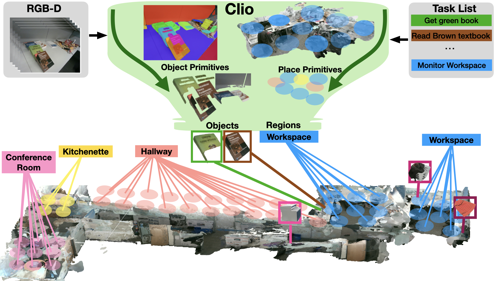

# Clio

This repository will contain the code for *Clio: Real-time Task-Driven Open-Set 3D Scene Graphs*. 



We propose Clio, a novel approach for building task-driven 3D scene graphs in real-time with embedded open-set semantics. We draw inspiration from the classical Information Bottleneck principle to form task- relevant clusters of object primitives given a set of natural language tasks — such as ''Read brown textbook'' — and by clustering the scene into task-relevant semantic regions such as “Kitchenette” or “Workspace”.

# Table of Contents
* [Paper](#Paper)
* [Video](#Video)   

> **__Note:__** The code and datasets will be released here shortly.
>
> **Datasets**
> - Coming soon
>
> **Setup**
> - Coming soon

# Paper
If you find this useful for your research, please consider citing our paper:
* Dominic Maggio, Yun Chang, Nathan Hughes, Matthew Trang, Dan Griffith, Carlyn Dougherty, Eric Cristofalo, Lukas Schmid, Luca Carlone, "**Clio: Real-time Task-Driven Open-Set 3D Scene Graphs**", in *ArXiv Preprint*, 2024. [ArXiv-Link](http://arxiv.org/abs/2404.13696)

  ```bibtex
   @misc{Maggio2024Clio,
      title={Clio: Real-time Task-Driven Open-Set 3D Scene Graphs}, 
      author={Dominic Maggio and Yun Chang and Nathan Hughes and Matthew Trang and Dan Griffith and Carlyn Dougherty and Eric Cristofalo and Lukas Schmid and Luca Carlone},
      year={2024},
      eprint={2404.13696},
      archivePrefix={arXiv},
      primaryClass={cs.RO}
   }
  ```

# Video
An overview of Clio is available on [YouTube](https://www.youtube.com/watch?v=m-HJO10qhSQ):